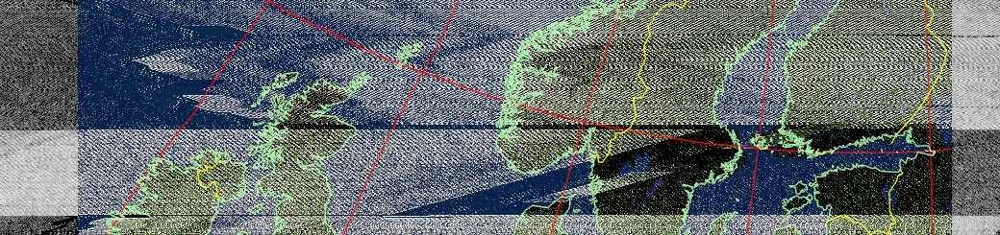
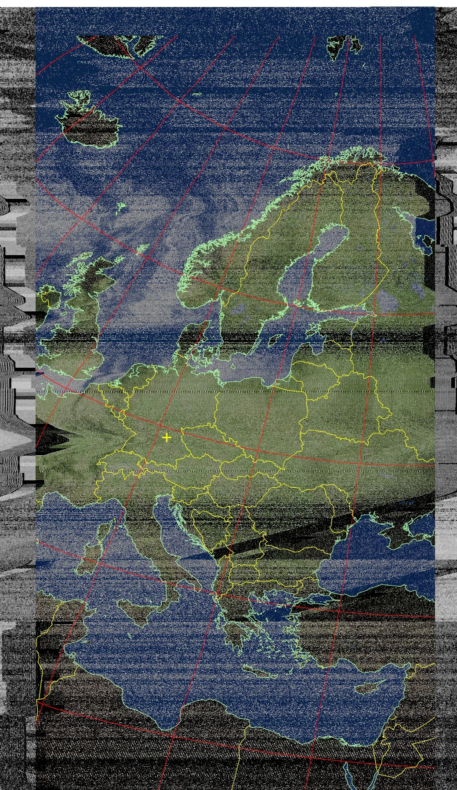
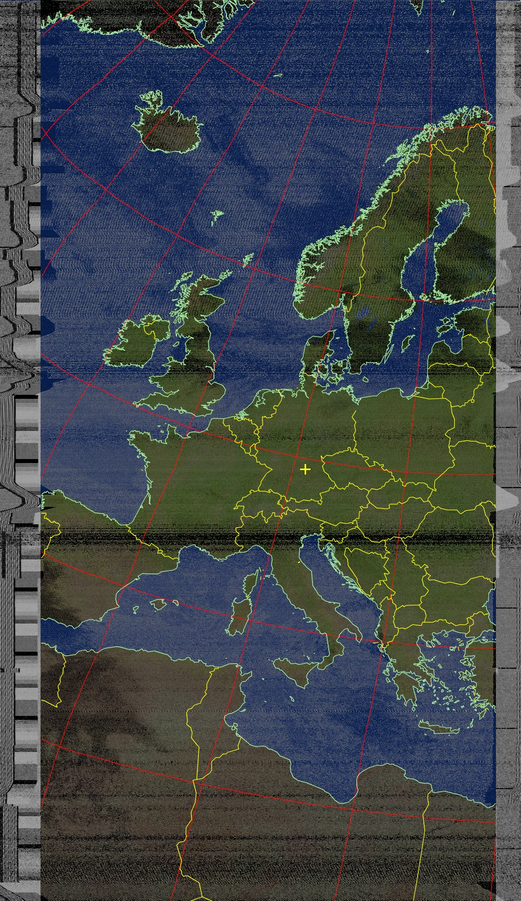
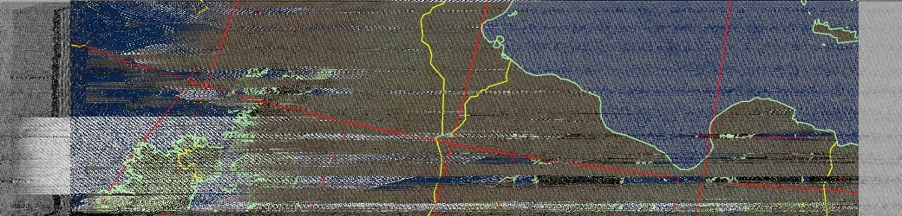
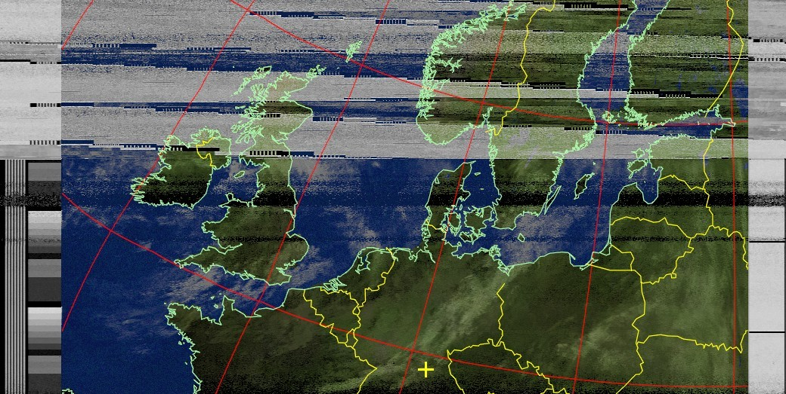

# Satellite images from NOAA Satellites

This project was initiated for the storage of satellite images obtained as a result of the analysis of audio data received from NOAA satellites 15-18 and 19. The location where the sound data were obtained is (with WebSDR interface) Nuremberg, JN59NJ, Bavaria, Germany.

* [10-Day Pass Predictions](#10-day-predictions)
* [Information about NOAA Satellites](#information-about-noaa-satellites)
  * [NOAA-15](#noaa-15)
  * [NOAA-18](#noaa-18)
  * [NOAA-19](#noaa-19)
* [Information about Nuremberg, Bavaria, Germany](#information-about-nuremberg-bavaria-germany)
* [All programs and websites, what we used](#all-programs-and-websites-what-we-used)
* [All Images From Satellites](#all-images-from-satellites)
  * [Sorted by Satellite Type](#sorted-by-satellite-type)
  * [Sorted By Date](#sorted-by-date)

## 10-Day Predictions

| Satellite | Date, Local time | Elevation | Local time | Duration  | Mag   |
|-----------|------------------|-----------|------------|-----------|-------|
| NOAA-18   | 15-Feb 11:13     | 88°       | 11:28      | 15 Minute | +5.2  |
| NOAA-15   | 15-Feb 18:29     | 56°       | 18:44      | 15 Minute | +5.9  |
| NOAA-18   | 16-Feb 11:01     | 72°       | 11:16      | 15 Minute | +5.3  |
| NOAA-19   | 16-Feb 19:50     | 83°       | 20:06      | 16 Minute | +5.7  |
| NOAA-18   | 17-Feb 10:48     | 58°       | 11:04      | 16 Minute | +5.5  |
| NOAA-15   | 17-Feb 19:18     | 61°       | 19:33      | 15 Minute | +5.8  |
| NOAA-19   | 17-Feb 19:38     | 81°       | 19:54      | 16 Minute | +5.7  |
| NOAA-15   | 18-Feb 18:53     | 85°       | 19:08      | 15 Minute | +5.6  |
| NOAA-19   | 18-Feb 19:26     | 66°       | 19:42      | 16 Minute | +5.9  |
| NOAA-18   | 18-Feb 22:07     | 68°       | 22:22      | 15 Minute | +7.2  |
| NOAA-15   | 19-Feb 18:28     | 54°       | 18:42      | 14 Minute | +5.9  |
| NOAA-18   | 19-Feb 21:55     | 84°       | 22:10      | 15 Minute | +7.1  |
| NOAA-18   | 20-Feb 21:43     | 80°       | 21:58      | 15 Minute | +7.0  |
| NOAA-18   | 21-Feb 11:40     | 59°       | 11:56      | 16 Minute | +5.5  |
| NOAA-15   | 21-Feb 19:17     | 63°       | 19:31      | 14 Minute | +5.8  |
| NOAA-18   | 21-Feb 21:30     | 65°       | 21:46      | 16 Minute | +6.9  |
| NOAA-18   | 22-Feb 11:28     | 72°       | 11:44      | 16 Minute | +5.3  |
| NOAA-15   | 22-Feb 18:51     | 83°       | 19:06      | 15 Minute | +5.6  |
| NOAA-18   | 23-Feb 11:16     | 88°       | 11:32      | 16 Minute | +5.2  |
| NOAA-19   | 23-Feb 20:07     | 63°       | 20:23      | 16 Minute | +5.9  |
| NOAA-18   | 24-Feb 11:04     | 76°       | 11:19      | 15 Minute | +5.2  |
| NOAA-19   | 24-Feb 19:55     | 78°       | 20:11      | 16 Minute | +5.7  |

## Information about NOAA Satellites

### NOAA-15

* The NOAA-15 satellite is a polar-orbiting weather forecast satellite operated by the National Oceanic and Atmospheric Administration (NOAA) and maintained operational by NASA. Launched on May 13, 1998 in the Titan 23G launch vehicle. Orbits every 101.20 minutes on 808.0 km above Earth.
* Downlink: 137.620 MHz (APT)
* Downlink: 1702.500 MHz (HRPT)
* For more information <https://en.wikipedia.org/wiki/NOAA-15>

(<a href="#satellite-images-from-noaa-satellites">Back to top</a>)

### NOAA-18

* The NOAA-18 satellite is a polar-orbiting weather forecast satellite operated by the National Oceanic and Atmospheric Administration (NOAA) and maintained operational by NASA. Launched on May 20, 2005 in the Delta II launch vehicle. Orbits every 102.12 minutes on 854.0 km above Earth.
* Downlink: 137.9125 MHz (APT)
* Downlink: 1707.000 MHz (HRPT)
* For more information <https://en.wikipedia.org/wiki/NOAA-18>

(<a href="#satellite-images-from-noaa-satellites">Back to top</a>)

### NOAA-19

* The NOAA-18 satellite is a polar-orbiting weather forecast satellite operated by the National Oceanic and Atmospheric Administration (NOAA) and maintained operational by NASA. After several attempts launched on Feb 6, 2009 in the Delta II launch vehicle. Orbits every 101.9 minutes on 866.0 km above Earth.
* Downlink: 137.100 MHz (APT)
* Downlink: 1698.000 MHz (HRPT)
* For more information <https://en.wikipedia.org/wiki/NOAA-19>

(<a href="#satellite-images-from-noaa-satellites">Back to top</a>)

## Information about Nuremberg, Bavaria, Germany

Nuremberg (German: Nürnberg) is the second largest city in Bavaria, Germany. The city is located approximately 170 kilometers north of Munich. There are colleges, exhibition centers and Nuremberg Airport (Nuremberg Airport "Albrecht Dürer") in the city. With its many towers, Nuremberg Castle is one of the largest castles in Europe. Nurnberg FC is the most famous football club in the city and one of the most successful football clubs in Germany. Nuremberg was one of the venues for the 2006 World Cup.

(<a href="#satellite-images-from-noaa-satellites">Back to top</a>)

## All programs and websites, what we used

* WXtoIMG-restored <https://wxtoimgrestored.xyz/>
* Keplers Data Updater <https://github.com/stefan-wr/keplers-updater-for-wxtoimg>
* Virtual Audio Cable <https://vb-audio.com/Cable/>
* WebSDR <http://nbgsdr.ddns.net/>
* Airspy WebSDR <https://airspy.com/directory/>
* N2YO <https://www.n2yo.com/>
* DDE Tracker Plugin <https://www.satsignal.eu/software/DDETracker.html>
* SDR-Sharp <https://airspy.com/download/>
* Orbitron <https://www.stoff.pl/downloads.php>

(<a href="#satellite-images-from-noaa-satellites">Back to top</a>)

## All Images From Satellites

### Sorted by Satellite Type

NOAA-15

|#|Date|Time|Duration|Preview|
|--- |--- |--- |--- |--- |
|1|14.02.2023|19:04|14 Minute||
|2|15.02.2023|18:30|18 Minute||
|3|-|-|-|-|
|4|-|-|-|-|
|5|-|-|-|-|

NOAA-18

|#|Date|Time|Duration|Preview|
|--- |--- |--- |--- |--- |
|1|10.02.2023|22:04|15 Minute||
|2|-|-|-|-|
|3|-|-|-|-|
|4|-|-|-|-|
|5|-|-|-|-|

NOAA-19

|#|Date|Time|Duration|Preview|
|--- |--- |--- |--- |--- |
|1|14.02.2023|20:15|15 Minute||
|2|16.02.2023|19:52|10 Minute||
|3|-|-|-|-|
|4|-|-|-|-|
|5|-|-|-|-|

### Sorted By Date

ALL

|#|Date|Time|Duration|Satellite|Preview|
|--- |--- |--- |--- |--- |--- |
|1|10.02.2023|22:04|15 Minute|NOAA-18||
|2|14.02.2023|19:04|14 Minute|NOAA-15||
|3|14.02.2023|20:15|15 Minute|NOAA-19||
|4|15.02.2023|18:30|18 Minute|NOAA-15||
|4|16.02.2023|19:52|10 Minute|NOAA-19||
|5|-|-|-|-|-|
|6|-|-|-|-|-|
|7|-|-|-|-|-|
|8|-|-|-|-|-|
|9|-|-|-|-|-|
|10|-|-|-|-|-|

(<a href="#satellite-images-from-noaa-satellites">Back to top</a>)

